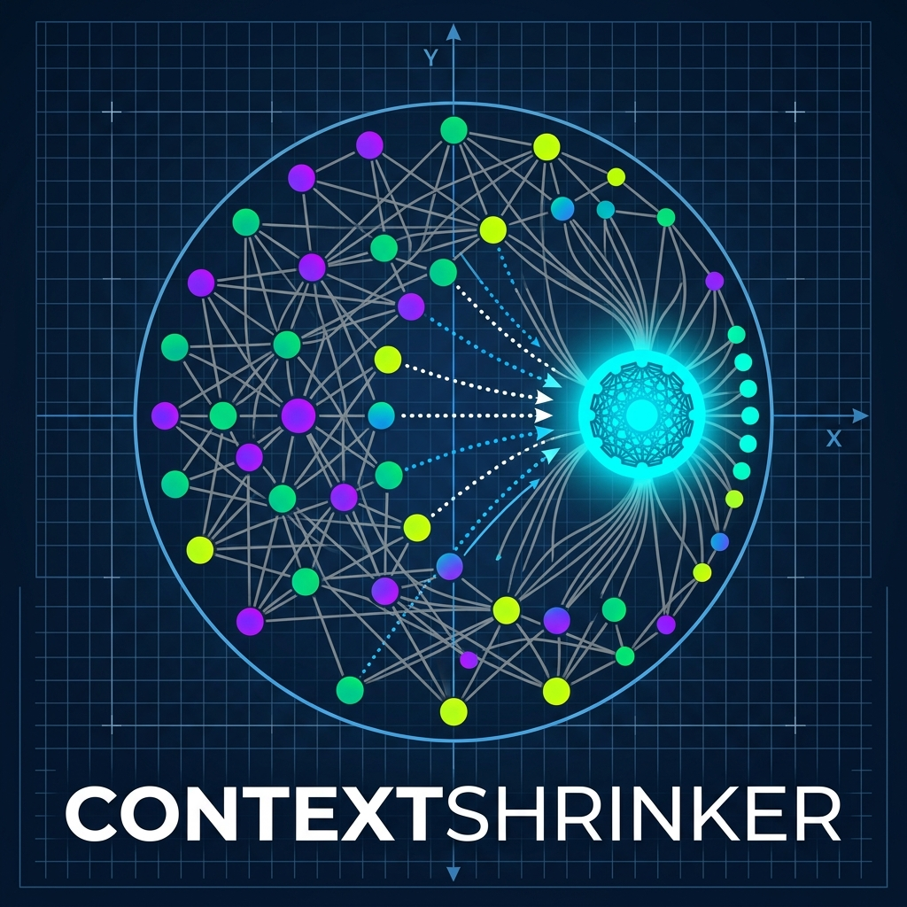
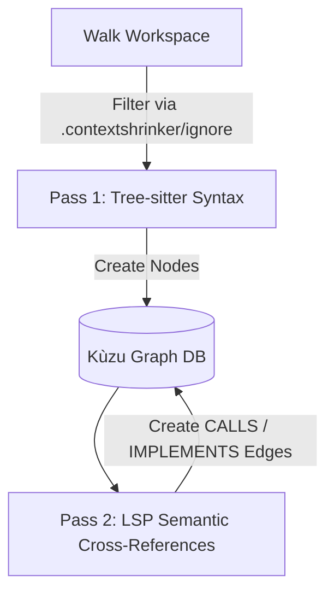

<p align="center">
  
</p>

# contextshrinker

**contextshrinker** is a zero-dependency, headless Model Context Protocol (MCP) server written in Go. It indexes local codebases into an embedded Kùzu graph database to drastically reduce LLM token bloat for autonomous AI agents (such as Claude Code, Cursor, Antigravity IDE, Aider, and Claude Desktop).

Instead of forcing AI agents to read raw source files or run clumsy grep-based searches, **contextshrinker** allows agents to query a semantic graph of your project's architectural dependencies, function call chains, and class inheritance structures—reducing input context consumption by **90% to 98%**.

---

## 🚀 Key Features

* **Universal Agent Compatibility:** Attaches seamlessly to any MCP-compliant coding tool or IDE over standard I/O (`stdio`).
* **Zero External Databases:** Completely self-contained. Runs an in-process graph database (Kùzu) inside your project's local `.contextshrinker/` directory.
* **Auto-Managed LSP Daemons:** Automatically detects project languages, programmatically provisions sandboxed language servers (like `gopls` for Go or `pyright` for Python) if missing, and queries their RPC interfaces in the background to build call graphs.
* **Multi-Language Support:** Full AST syntax parsing and semantic indexing for **Go, Python, JavaScript, TypeScript, and Java**.
* **Clean Project Isolation:** Every workspace maintains its own `.contextshrinker/` directory containing isolated configuration rules (`.contextshrinker/ignore`) and graph database files (`.contextshrinker/db/`).
* **Live State Sync:** Uses `fsnotify` to watch your files recursively. On save, a debounced delta update purges old nodes and re-indexes modified files in real-time.
* **Interactive Graph Visualization:** Generates a stunning, Vis.js-powered dark-mode HTML codebase visualization (`.contextshrinker/contextshrinker_graph.html`) on-demand.

---

## 🛠️ Architecture: The Two-Pass Ingest

To index your code cleanly, **contextshrinker** runs a two-pass ingestion sequence:



1. **Pass 1 (Tree-sitter AST Extraction):** Rapidly scans source files to extract entities (Functions/Methods, Classes/Structs, Variables) and their associated docstrings, inserting them as nodes.
2. **Pass 2 (LSP Semantic Resolving):** Queries background Language Server Protocol (LSP) daemons for cross-references to identify and connect invocations (`CALLS`), imports (`IMPORTS`), and class inheritances (`IMPLEMENTS` / `EXTENDS`).

---

## 📥 Installation

### Prerequisites
* [Go](https://go.dev/) (1.21 or later)
* Node.js & npm (for automatically installing JS/TS and Python LSPs)

### Build from Source
Clone the repository and run:
```bash
go build -o contextshrinker
```
To install it directly to your system `PATH`:
```bash
go install
```

---

## 🔌 Integration into Coding Agents

`contextshrinker` runs on-demand as a child process of your coding agent. Register the absolute path to the compiled binary in your client:

### 1. Antigravity IDE (Gemini Agent Panel)
1. Open the **Antigravity IDE**.
2. Click the **`...` (More Options)** menu in the Agent Panel.
3. Select **"Manage MCP Servers"** $\rightarrow$ **"View raw config"**.
4. Register the server in your `mcp_config.json`:
   ```json
   {
     "mcpServers": {
       "contextshrinker": {
         "command": "/absolute/path/to/contextshrinker"
       }
     }
   }
   ```

### 2. Claude Code (CLI)
Add the server automatically:
```bash
claude mcp add contextshrinker /absolute/path/to/contextshrinker
```

### 3. Cursor IDE
1. Navigate to **Settings** $\rightarrow$ **Features** $\rightarrow$ **MCP**.
2. Click **+ Add New MCP Server**.
3. Set configuration:
   * **Name:** `contextshrinker`
   * **Type:** `command`
   * **Command:** `/absolute/path/to/contextshrinker`

### 4. Claude Desktop
Add it to your `~/Library/Application Support/Claude/claude_desktop_config.json`:
```json
{
  "mcpServers": {
    "contextshrinker": {
      "command": "/absolute/path/to/contextshrinker"
    }
  }
}
```

---

## 🧰 Exposed Tools

Once configured, the following tools will automatically be available to your AI coding agents:

1. **`search_codebase`**
   * *Arguments:* `query` (string)
   * *Description:* Executes Full-Text Search and Cypher queries to match structures and docstrings across classes, functions, and variables.
2. **`get_call_chain`**
   * *Arguments:* `target_function` (string), `depth` (integer, max 5)
   * *Description:* Resolves upstream caller chains using variable-length path Cypher queries to map calling dependencies.
3. **`get_file_structure`**
   * *Arguments:* `file_path` (string)
   * *Description:* Retrieves the complete abstract node structure (classes, interfaces, methods, variables) contained in a single file without feeding the raw text contents to the context window.
4. **`visualize_codebase`**
   * *Description:* Triggers an on-demand HTML export, saving `contextshrinker_graph.html` inside your `.contextshrinker/` directory.
5. **`get_architecture_report`**
   * *Description:* Retrieves the complete codebase architectural health report containing metrics on God Objects, coupling hotspots, cycles, and dead unexported functions directly to your LLM context.

---

## 🏛️ Codebase & Architecture Optimization

You can use **contextshrinker** to systematically audit coupling, analyze domain boundaries (DDD), and guide code restructuring (e.g. splitting a monolith into modules) using LLMs.

### Optimization Workflow

1. **Generate the Architectural Metrics**:
   Run the analysis command in your terminal to inspect the codebase graph and generate a report:
   ```bash
   ./contextshrinker analyze
   ```
   This generates `contextshrinker-report.md` containing metrics for **God Objects** (high outbound coupling), **Black Holes** (high inbound calls), **Cyclic Import Paths**, and **Dead Code** (unused private functions).

2. **Obtaining the System Prompt**:
   Retrieve the principal systems architect prompt from the CLI:
   ```bash
   ./contextshrinker prompt architect
   ```

3. **Analyzing with LLMs**:
   - Set the output of the `prompt architect` command as the **System Prompt** for your LLM.
   - Provide the contents of the generated `contextshrinker-report.md` as the **Context / Input**.
   - Ask the LLM to propose bounded context splits or interface boundaries.

4. **Agentic / Tool-Use Workflows**:
   If using an MCP-compatible agent (like Antigravity IDE, Claude Code, or Cursor), you can ask it directly:
   > *"Run the contextshrinker analysis report, read the generated markdown, and act as a Systems Architect to audit our design hotspots. Use the `get_call_chain` and `get_file_structure` tools to inspect the coupling before suggesting concrete module extractions."*

---

## ⚙️ Configuration & Ignores

To prevent workspace graph bloat, standard library and dependency folders (`node_modules/`, `vendor/`, `.git/`, etc.) are ignored by default.

To add custom ignores, write them to `.contextshrinker/ignore` (created automatically in your project root on first start). Each line is matched recursively:
```text
# Custom project ignores
*.log
tmp-output/
dist/
```

---

## 📊 Command Line Interface (CLI) Mode

You can query the codebase graph, start the MCP server daemon explicitly, retrieve systems architect prompts, or generate health analysis reports directly from your terminal.

### 1. Start the MCP Server
By default, running `./contextshrinker` with no arguments starts the MCP server daemon. You can also trigger it explicitly:
```bash
./contextshrinker start
```

### 2. Run Codebase Architectural Analysis
Analyze the codebase structure (God objects, inbound call hot-spots, cyclic imports, dead code) and write a report to `contextshrinker-report.md`:
```bash
./contextshrinker analyze
```

### 3. Print Principal Systems Architect Prompt
Print the Domain-Driven Design (DDD) principal systems architect system prompt to stdout:
```bash
./contextshrinker prompt architect
```

### 4. Search the Codebase
Find functions, classes, or variables matching a query:
```bash
./contextshrinker search "IngestWorkspace"
```

### 5. Trace Call Chains
Trace upstream callers of a target function name (default depth is 3, maximum is 5):
```bash
./contextshrinker call-chain "IngestWorkspace" --depth 3
```

### 6. Retrieve File Structure
Get the structure of a file without reading its full text content:
```bash
./contextshrinker structure "main.go"
```

### 7. Generate Interactive Visualization
Generate a Vis.js codebase graph representation:
```bash
./contextshrinker visualize
```
Open the generated `.contextshrinker/contextshrinker_graph.html` in any browser to explore your project's architecture interactively.

### Options (Global Flags)
* `--workspace <path>`: Specifies the project directory (defaults to `.`).
* `--db <path>`: Specifies the database storage directory (defaults to `.contextshrinker/db`).
* `--reindex`: Forces a full workspace ingestion scan (re-parsing code and mapping LSP relationships) before executing the query. If the database is empty, ingestion runs automatically.

* **Note:** Because Kuzu DB establishes an exclusive file-level lock, ensure your IDE's MCP client is paused or stopped when running CLI commands on the active database, or use a different workspace/db directory with the CLI flags.

---

## 📄 License
This project is licensed under the MIT License.
